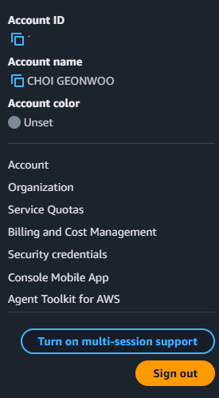
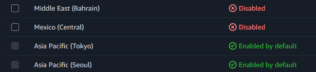
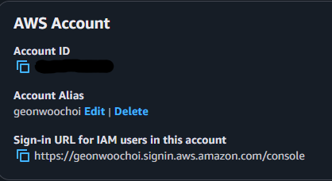

# 1. AWS 계정 설정

## 1.1 AWS 계정 ID 확인



자신의 AWS 계정의 ID를 확인하고자 한다면 Dashboard 페이지에서 우측 상단 Username을 클릭하면 확인이 가능하고 ID는 기본적으로 고유한 숫자 12자리를 부여 받아 ID가 포함된 웹 URL을 입력해 로그인하면 되지만, 별칭으로 계정이 생성된 경우에는 로그인 URL에서 별칭으로 대체해 로그인하면 된다.

**로그인 페이지 URL의 형식은 기본적으로 다음과 같이 입력하면 된다.**
```md
https://Your_Account_ID.signin.aws.amazon.com/console/
```

**로그인 페이지 URL에서 별칭을 사용해 입력 후 로그인하면 된다.**
```md
https://Your_Account_Alias.signin.aws.amazon.com/console/
```

> [!WARNING]
> **계정 별칭 생성 시 고려 사항은 다음과 같다.**
> * AWS 계정은 별칭을 하나만 가질 수 있으며, AWS 계정의 새 별칭을 생성하면 이전 별칭이 덮어쓰여 이전 별칭을 포함하는 URL은 작동하지 않는다.
> * 계정 별칭은 숫자, 소문자 및 하이폰 (`-`)만 포함해야 한다.
> * 계정 별칭은 지정된 네트워크 파티션 내 모든 AWS 제품에서 고유해야 하고 파티션은 AWS 리전의 그룹이기 때문에 하나의 파티션으로 범위가 지정된다.

### 1.1.1 AWS Region 액세스 여부 확인



> [!NOTE]
> **AWS 사용자는 기본적으로 액세스 가능한 지역들이 설정되어 있으며, 별도로 설정을 통해 변경이 가능하나 지역별로 부과되는 평균적인 금액이 다르며 연결이 원할하지 않은 상태에서 작업이 어려울 수 있다.**

## 1.2 AWS 계정 별칭 생성



# 2. AWS 사용자 정책 설정


```json
{
	"Version": "2012-10-17",
	"Id": "example-user-1",
	"Statement": [
		{
			"Sid": "Statement1",
			"Effect": "Allow",
			"Action": [
				"ec2:DeleteSubnet",
				"ec2:DeleteRoute",
				"ec2:DeleteVpc",
				"ec2:DeleteVolume",
				"ec2:CreateVpc",
				"ec2:CreateVolume",
				"ec2:CreateSubnet",
				"ec2:CreateSnapshot",
				"ec2:CreateRoute",
				"ec2:CreateNatGateway",
				"ec2-instance-connect:*"
			],
			"Resource": [
                "arn:aws:ec2:{Region}:{Account}:instance/{InstanceId}",
                "*"
            ]
		}
	]
}
```

#### Issue Troubleshooting

* Troubleshooting 1 : IAM Policy JSON edit access settings apply error
	```md
	arn:aws:ec2:{Region}:{Account}:instance/{InstanceId}
	```

	```md
	The Region {ap-northeast-2} is not valid for this resource. Update the resource ARN to include a supported Region.
	```
	* Solve Solution